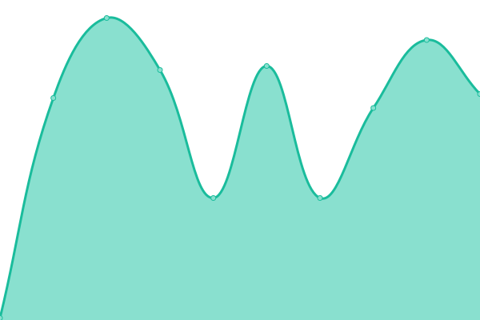
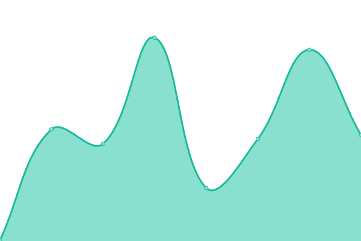

# [📈 Live Status](https://status.nerd.net): <!--live status--> **🟩 All systems operational**

This repository contains the open-source uptime monitor and status page for [Frederick Morlock](https://freddy.us), powered by [Upptime](https://github.com/upptime/upptime).

With [Upptime](https://upptime.js.org), you can get your own unlimited and free uptime monitor and status page, powered entirely by a GitHub repository. We use [Issues](https://github.com/FrederickGeek8/uptime-nerd.net/issues) as incident reports, [Actions](https://github.com/FrederickGeek8/uptime-nerd.net/actions) as uptime monitors, and [Pages](https://status.nerd.net) for the status page.

<!--start: status pages-->
<!-- This summary is generated by Upptime (https://github.com/upptime/upptime) -->
<!-- Do not edit this manually, your changes will be overwritten -->
<!-- prettier-ignore -->
| URL | Status | History | Response Time | Uptime |
| --- | ------ | ------- | ------------- | ------ |
|  [NERD.net Social](https://social.nerd.net) | 🟩 Up | [nerd-net-social.yml](https://github.com/FrederickGeek8/uptime-nerd.net/commits/HEAD/history/nerd-net-social.yml) | 

 241ms
     
 | 

<a href="https://status.nerd.net/history/nerd-net-social">100.00%</a>
    

|  [NERD.net File Hosting](https://files.nerd.net/anchor.jpg) | 🟩 Up | [nerd-net-file-hosting.yml](https://github.com/FrederickGeek8/uptime-nerd.net/commits/HEAD/history/nerd-net-file-hosting.yml) | 

 174ms
     
 | 

<a href="https://status.nerd.net/history/nerd-net-file-hosting">100.00%</a>
    

|  [NERD.net Main](https://nerd.net) | 🟩 Up | [nerd-net-main.yml](https://github.com/FrederickGeek8/uptime-nerd.net/commits/HEAD/history/nerd-net-main.yml) | 

 146ms
     
 | 

<a href="https://status.nerd.net/history/nerd-net-main">100.00%</a>
    

<!--end: status pages-->

[**Visit our status website →**](https://status.nerd.net)

## 📄 License

- Powered by: [Upptime](https://github.com/upptime/upptime)
- Code: [MIT](./LICENSE) © [Frederick Morlock](https://freddy.us)
- Data in the `./history` directory: [Open Database License](https://opendatacommons.org/licenses/odbl/1-0/)
